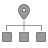

# Visual Docs
### Diagrams and animations documenting SSB and Āhau

Made as Scalable Vector Graphic (SVG) files, animated as needed with CSS.
These are made to accompany and illustrate text explanations.

## Animations
### Replication: connecting via a pātaka

### Replication: connecting locally

_**Note:** These two 'replication' animations have been written using [anime.js](https://animejs.com) within SVG, as it provides much, much more flexibility than writing animation directly in CSS within SVG.
As Github will not play JS animations within Markdown, the above embedded animation is a recording of the animation, converted to GIF so it can be played anywhere.
The source SVGs can also be downloaded and opened with a web browser to display the animation at full quality, or to inspect/edit the code. Once the animation has been finalized, I'll make a CSS-in-SVG version, as GIFs are worse by basically every measure - see this comparison using the 'local replication' animation:_

|            | SVG    | MP4    | GIF    |
|------------|--------|--------|--------|
| Resolution |  ∞     | 2000px | 1000px |
| Framerate  | ~60fps | 30fps  | 15fps  |
| Filesize   | 0.05Mb | 1.5Mb  | 2.9Mb  |

----

### Infrastructure Comparison

_Example text: With a 'normal' internet service, your data may be housed in a large
corporate data center overseas._

_Example text: A Pātaka server can be a small, simple device or a large professional
setup, depending on your needs and preferences._

### Port Forwarding (full animation)

In practice this would probably make more sense when split up and displayed alongside
the text explanations, like so:

_1. Explanation of how/why an internet request is made_

----

_2. Explanation of ports, and a request for a specific port_

----

_3. Explanation of port forwarding_

## Icons

Examples of the style and format of icons, in 48px and 96px:

 

 
 

----
 

 
 

----

The animation in the WiFi, Internet and Router icons can be removed by deleting or
commenting out the `` section of the SVG.
