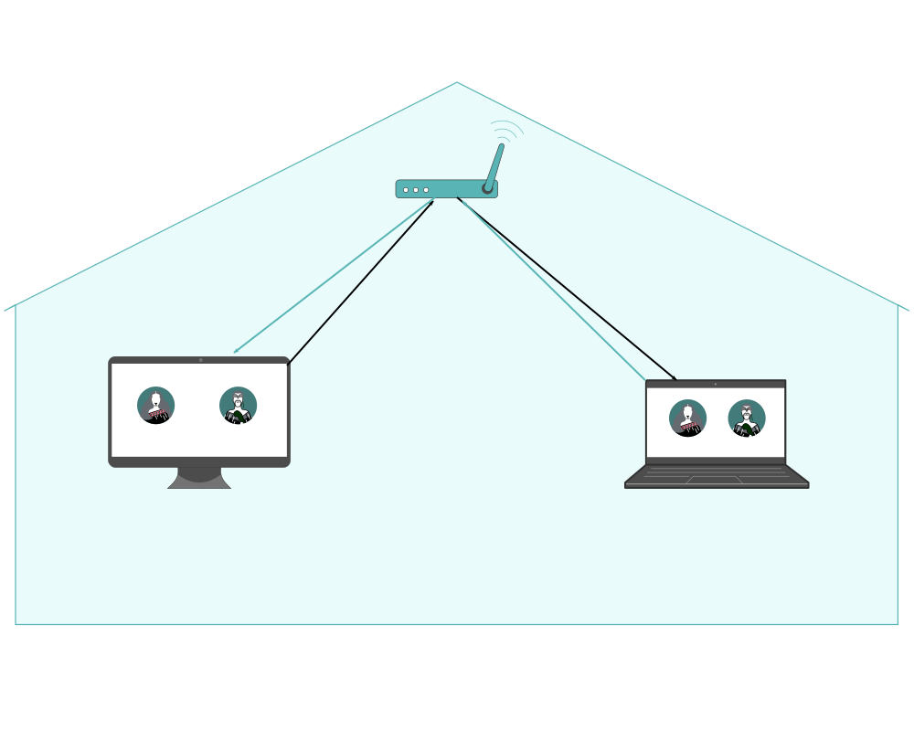

# Roadmap
Planned illustrations, animations and icons, and current progress made.
## Key:  
✔ Done | ✖️ Planned, not done | **-** Not (yet) applicable or not planned

| TOPIC                    | CONCEPT/SKETCH | ILLUSTRATION | ANIMATION | PUBLISHED | THUMB                          | REVIEWED    |
|--------------------------|----------------|--------------|-----------|-----------|--------------------------------|-------------|
| **Equipment checklist:** |                |              |           |           |                                |      ✖️      |
| Smartphone icon          |        ✔       |       ✔      |   **-**   |     ✔     |    |             |
| Laptop icon              |        ✔       |       ✔      |   **-**   |     ✔     |    |             |
| Internet icon            |        ✔       |       ✔      |     ✔     |     ✔     |  |             |
| Router icon              |        ✔       |       ✔      |     ✔     |     ✔     |    |             |
| WiFi icon                |        ✔       |       ✔      |     ✔     |     ✔     |      |             |
| Ethernet icon            |        ✔       |       ✔      |   **-**   |     ✔     |  |             |
| Static IP icon           |        ✔       |       ✔      |   **-**   |     ✔     | |             |
| **Pātaka Setup:**        |                |              |           |           |                                |    **-**    |
| Static IP address        |        ✔       |       ✖️      |     ✖️     |     ✖️     |                                |             |
| Port Forwarding          |        ✔       |       ✔      |     ✔     |     ✔     | | ✖️ |
| **Āhau-specific icons:** |                |              |           |           |                                |    **-**    |
| Whānau archive icon      |        ✖️       |       ✖️      |     ✖️     |     ✖️     |                                |             |
| Pātaka connect code      |        ✖️       |       ✖️      |     ✖️     |     ✖️     |                                |             |
| Encrypted message        |        ✖️       |       ✖️      |     ✖️     |     ✖️     |                                |             |
| Support chat icon        |        ✖️       |       ✖️      |     ✖️     |     ✖️     |                                |             |
| **Infrastructure:**      |                |              |           |           |                                |      ✖️      |
| Compare: corporate server|        ✔       |       ✔      |     ✔     |     ✔     |   |             |
| Compare: Āhau / SSB      |        ✔       |       ✔      |✔ (basic)  |     ✔     |  |           |
| **Replication:**         |                |              |           |           |                                |    **-**    |
| Compare: Facebook etc    |        ✔       |       ✔      |     ✖️     |     ✖️     |                                |             |
| Sync via Internet/Pātaka |        ✔       |       ✔      |     ✔     |     ✔     | |             |
| Local sync over WiFi     |        ✔       |       ✔      |     ✔     |     ✔     | |             |
| Pātaka-to-Pātaka         |        ✔       |       ✔      |     ✖️     |     ✖️     |                                |             |
| **Encryption:**          |                |              |           |           |                                |    **-**    |
| Data on a Pātaka         |        ✔       |       ✔      |     ✖️     |     ✖️     |                                |             |
