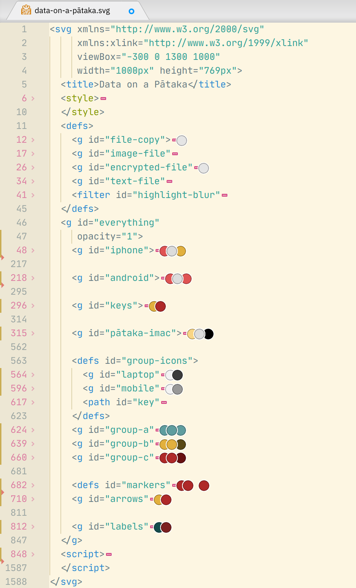
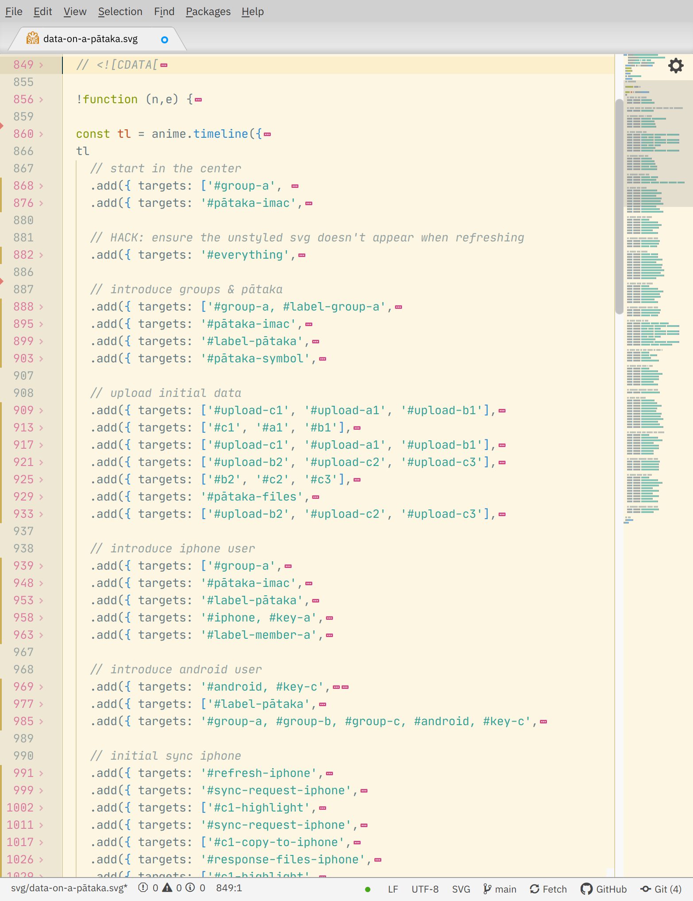

# Editing animations
Do you want to adapt these animations for your own purposes, experiment with them
or improve them in some way? Great! Here are a few pointers for understanding the
files, the animation syntax, the formats and what you can do with them.

## Contents

- [**editing SVG**](#editing-svg)
- [**changing fonts**](#changing-fonts)
- [**editing CSS**](#editing-css)
- [**editing anime.js**](#editing-animejs)
- [**converting an anime.js timeline to CSS**](#converting-an-animejs-timeline-to-css)
- [**editing video**](#editing-video)

## Editing SVG
I have tried to keep the SVG code as readable as possible, so you should be able
to do quite a lot of editing from a text editor.

- If you've never touched SVG code or CSS animation before, I recommend that you
check out my [_Draw with Code_ zine](https://solarpunk.cool/zines/draw-with-code/index.html)
for a overview and step-by-step tutorial.

- You can use a simple text editor but I recommend using an IDE like Atom,
Brackets or VS Code, with an SVG Preview plugin.
More info and links to these editors & plugins can be found in the
[tools page](https://solarpunk.cool/zines/draw-with-code/tools.html) of the zine.

- using an IDE will also allow you to [fold](https://flight-manual.atom.io/using-atom/sections/folding/) nested content, and only unfold the
specific parts you're interested in, allowing you to navigate through a 1588-line complex SVG and maintain an overview:



- Every element in every animation either has its own `id`, or is in a `<g>` (group)
with an `id`. If you're still not sure which part of the image the code refers to,
try commenting it out (Select it, then use the shortcut **Ctrl + \\** in Atom).
If the right thing disappears, great!

- You can move things around by editing their `x` & `y` attributes directly or you
can apply different types of `transform` to elements or groups of elements.
But just a word of warning: if you're changing/adding transforms, you may need to
adjust that element's `style="transform-origin:[x]px [y]px [z]px;"` value, or it
will scale / rotate from the wrong place.

- If the animation is distracting you while you're trying to make other changes,
you can comment out the CSS animation: look for `@keyframes` rulesets in
`<style>`, or the `<script>` section if it's an anime.js animation. In practice,
that `<script>` section is huge, so I usually don't comment it all out while I'm
working- I just change `<script>` to `script>` (delete the opening `<` character)
to make the whole thing invalid. Replace it again, and your animation comes back
to life.

- You can also edit SVG in a graphical editor like [Inkscape](inkscape.org) or
Illustrator. But there may be some snags along the way - see the
[_Making Static Images_](./making-static-images.md) document for more info.

## Changing Fonts
The SVG files which contain text and are animated with CSS have embedded fonts,
so that they will look right when used as an `` (and thus can't access external
resources like Google Fonts etc). Fonts can make an SVG quite heavy, so I've only
used a subset of my chosen typeface (Dosis), which is just Basic Latin, `.`, `:`, `?`
and the macron vowels used in Māori (`ĀāĒēĪīŌōŪū`). If you want to use a different
typeface, or a different subset of Dosis, you can read Amelia Bellamy-Royd's
[article on embedding data URI fonts](https://oreillymedia.github.io/Using_SVG/extras/ch07-dataURI-fonts.html)
and use [Font Squirrel's webfont generator](https://www.fontsquirrel.com/tools/webfont-generator).

## Editing CSS

**NOTE:** Editing or writing complex CSS animations can be a horrible ordeal - if you're doing anything more than a little tweak, I would recommend [making changes in anime.js](#editing-animejs) and then [converting the animation to CSS](#converting-an-animejs-timeline-to-css).

CSS animations are contained within the `<style>` section near the top of the SVG,
they look like this:

```css
#request { animation: slide-request 20s linear infinite; }
@keyframes slide-request {
  0%, 12% { transform: translateX(6px); }
  14%, 100% { transform: translateX(0); }
}

#port-arrow { animation: fade-port-arrow 20s linear infinite; }
@keyframes fade-port-arrow {
  0%, 16% { opacity: 0; transform: scaleX(0); }
  17% { opacity: 1; }
  22%, 100% { transform: scaleX(1); opacity: 1; }
}
```

What's going on? let's break it down:

```css
#request {  /* select the element with an id of 'request' and apply these rules: */
  animation: slide-request 20s linear infinite;

    /* ↑ 'animation' is actually a shorthand form for all of these rules: ↓ */

  animation-name: slide-request; /* do whatever '@keyframes slide request' says */
  animation-duration: 20s;  /* take 20s to do it */
  animation-timing-function: linear;  /* don't use an easing function */
  animation-iteration-count: infinite;  /* loop forever */
 }
```
The animation `slide-request` doesn't mean anything until we define it and set
some keyframes, like this:

```css
@keyframes slide-request {  /* these are the keyframes for 'slide-request': */

  0%, 12% { transform: translateX(6px); }
  /* start (at 0% of the duration), with the object translated 6px to the right
  of its original position, where it was drawn. Hold it there until 12% through
  the animation-duration. (That would be 2.4s, if the duration is 20s) */

  14%, 100% { transform: translateX(0); }
  /* at 14% through the animation-duration (2.8s if duration is 20s), the element
  should be back at its 'true' position. So between 12% & 14%, the element's
  'translateX' property will be animating, and it will be sliding to the left.
  Hold after 14%, until the end of the animation (100%). */
}
```

```css
#port-arrow { animation: fade-port-arrow 20s linear infinite; }
/* apply the 'fade-port-arrow' keyframes to the element with an id of 'port-arrow'*/

@keyframes fade-port-arrow {    /* these are the 'fade-port-arrow' keyframes: */

  0%, 16% { opacity: 0; transform: scaleX(0); }
  /* Start with the element invisible: 0% opacity, and infinitely small.
  Hold it like that until 16% (3.2s if duration = 20s), then start animating. */

  17% { opacity: 1; }
  /* by 17% of the duration (3.3s), the element is already fully opaque, but
  still only 1/6th of its full scale */

  22%, 100% { transform: scaleX(1); opacity: 1; }
  /* by 22% (4.4s), the element is at its full size, and is still fully opaque.
  Hold like that, until the end of the animation (100%). */
}
```
Looking at these animations, you might think they are needlessly complex. If
each element is only actually animating for a second or so, why are the
animations both 20 seconds long?

Well, yes, CSS animations _are_ needlessly complex, if you want to make more
than a couple of changes. In the SVG that I took the above code from, there were
in fact 7 different sets of `@keyframes`, applied to different elements - all
with a duration of 20 seconds. This is because there is no  'timeline' or
'playlist' concept in CSS, so if I want different animations to happen at
different times, but stay in sync through multiple loops, the only way to do so
(or, the only way that _I_ know) is to make every animation the same length. That
way they all loop back to the start at the same time, and everything stays in
sync. It works, but it's infuriating when it comes to making changes to the
overall sequence.

I've tried to at least list the keyframes that happen first earlier in the file,
and the later ones later, but there's often a lot of overlap so it's an imprecise
art.

## Editing anime.js
For animations made with [anime.js](animejs.com), you'll see two sections of code within the `<script>` section of the SVG. The first part looks like this, but goes on much, much longer:

```javascript
!function(n,e){"object"==typeof exports&&"undefined"!=typeof module?
module.exports=e():"function"==typeof define&&define.amd?define(e)
:n.anime=e()}(this,function(){"use strict";var n={update:null,begin:
null,loopBegin:null,changeBegin:null,change:null,changeComplete:null,
loopComplete:null,complete:null,loop:1,direction:"normal",autoplay:
!0,timelineOffset:0},e={duration:1e3,delay:0,endDelay:0}...});
```

:grimacing:

Don't worry, you don't have to touch this - that's the anime.js javascript library, minified (squished to the point of being unreadable) to make the filesize smaller.
After that solid block of gibberish, you'll find the animation timeline that I've written. It will look something like this:

```javascript
const tl = anime.timeline({
  autoplay: true,
  loop: true,
  duration: 500,
  easing: 'easeInOutQuad'
})
tl
  .add({
    targets: ['#a', '#b', '#c'],
    opacity: [0, 1],
    delay: anime.stagger(600),
    duration: 1200
  }, 1000)
  .add({
    targets: '#arrow',
    scale: [0, 1],
  }, '-=250')
  .add({
    targets: '#label-pātaka',
    opacity: [0, 1],
    easing: 'linear'
    duration: 1000
  }, '+=400')
```
This is an anime.js timeline, and it's what you should be editing. It may look complicated, but it's less so than CSS animation, and very flexible once you get used to it. You can check out the [documentation](https://animejs.com/documentation/) for more specifics, but let's break it down:

```javascript
const tl = anime.timeline({ // 'tl' is an anime timeline object.
  autoplay: true,           // it will play as soon as the page loads.
  loop: true,               // it will loop once it is finished.
  duration: 500,            // each step will last 500ms (unless stated otherwise).
  easing: 'easeInOutQuad'   // each step will animate slowly at the start,
                            // then quickly, then slowly again at the end.
})                          // end of the definition of 'tl'.
```

_(see [`easeInOutQuad`](https://easings.net/#easeInOutQuad) and other easings visualized on [easings.net](https://easings.net/))_

```javascript
tl                              // take the 'tl' timeline object
  .add({                        // and add this to it:
    targets: ['#a', '#b', '#c'],// an animation targeting the elements with an
                                // id(#) of 'a', and 'b', and 'c'.
    opacity: [0, 1],            // transitioning their opacity from 0 to 1
                                // (fading them in).
    delay: anime.stagger(500),  // stagger their fade-ins: #b will start 500ms
                                // after #a starts, then #c 500ms later.
    duration: 750               // each fade-in will last 750ms (this statement
                                // overrides the default duration of 500 from 'tl').
  }, 500)                       // delay! this whole section will start at 500ms
                                // (this is an absolute time point, not relative)
```

So the timing so far is:

```javascript
0: 'tl' starts

500: '#a' starts its fade-in   ⊤
                               |
1000: '#b' starts its fade-in  |  ⊤
1250: '#a' finishes            ↓  |
1500: '#c' starts its fade-in     |  ⊤
1750: '#b' finishes               ↓  |
                                     |
2250: '#c' finishes                  ↓
```

ok, next section:

```javascript
.add({                // add this to the timeline:
  targets: '#arrow',  // an animation targeting the element with an
                      // id of 'arrow'.
  scale: [0, 1],      // grow the element from a scale of 0% to 100%
                      // (a scale of 0 means the element is not visible)
}, '-=250')           // relative, negative delay! this section will start 250ms
                      // *before* the previous part of the timeline ends.
```

That relative, negative delay means that the arrow will start growing _before_ the previous animation is entirely finished:

```javascript
1750: '#b' finishes              ↓  |  
2000: '#arrow' starts scaling up    |  ⊤
2250: '#c' finishes                 ↓  |
2500: '#arrow' finishes                ↓
```

Note that because `tl` set the default duration as `500`, and we didn't specify otherwise, `#arrow` will take 500ms to animate on.
Last section:

```javascript
.add({                      // add this to the timeline:
  targets: '#label-pātaka', // an animation targeting the element with an
                            // id of 'label-pātaka'.
  opacity: [0, 1],          // fade it in from 0% to 100%.
  easing: 'linear'          // use a 'linear' easing, not 'easeInOutQuad'
  duration: 750             // take 750ms, not 500ms
}, '+=500')                 // relative delay! this section will start 500ms
                            // *after* the previous part of the timeline ends.
```

The relative delay means that the label will start fading in 500ms _after_ the previous animations are finished:

```javascript
2000: '#arrow' starts scaling up         |  ⊤
2250: '#c' finishes                      ↓  |
2500: '#arrow' finishes                     ↓

3000: '#label-pātaka' starts fading in         ⊤
                                               |
                                               |
3750: '#label-pātaka' finishes                 ↓
```

Those relative delays are super-helpful when you want to make timing changes to a timeline. In a complex CSS animation, you would have to adjust EVERY! SINGLE! CHANGE! from that point on. :weary:
With anime.js, if you're using relative delays, everything just slides to a new point in time, maintaining the sequence with the animations around it. So you can delete sections or add new ones, and the rest of the timeline will be OK.
Have a play around with the animations, and check out the [anime.js documentation](https://animejs.com/documentation/) if anything doesn't make sense.

I would recommend using the [folding](https://flight-manual.atom.io/using-atom/sections/folding/) function in your IDE if you want to find your way around:



## Converting an anime.js timeline to CSS
If you're planning to make any changes to the _timing_ of these animations, rather than just changing colors or swapping out elements, I highly recommend that you do so with anime.js rather than CSS, whenever you have the choice. However, you may need the end product to be a CSS animation (eg. for sharing on SBB or Github).
In this case you'll need to convert the anime.js timeline into CSS animations, which would be _extremely_ difficult to attempt by hand. So I've written a script to make it much easier - you can find it and its documentation in the [`📁️ js`](../js) folder.
