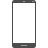
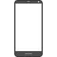
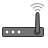
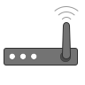
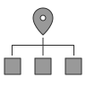

# PNG Icons

48px | 96px
-----|-----
 ethernet_48.png	|  ethernet_96.png
 internet_48.png	|  internet_96.png
 laptop_48.png |  laptop_96.png
 mobile_48.png |  mobile_96.png
 router_48.png	|  router_96.png
 static-ip_48.png	|  static-ip_96.png
 wifi_48.png |  wifi_96.png

- Icons have a stroke width displayed at 1px at both sizes.

- There has been some pixel-hinting done to ensure that straight lines and square shapes fall cleanly within the pixel grid, reducing blur. Curved shapes have had their bounding rectangles aligned but are not properly pixel-hinted.
