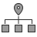

# SVG Icons

48px | 96px
-----|-----
 ethernet_48.svg	|  ethernet_96.svg
 internet_48.svg	|  internet_96.svg
 laptop_48.svg |  laptop_96.svg
 mobile_48.svg |  mobile_96.svg
 router_48.svg	|  router_96.svg
 static-ip_48.svg	|  static-ip_96.svg
 wifi_48.svg |  wifi_96.svg

- The animation in the WiFi, Internet and Router icons can be removed by deleting or commenting out the `` section in the SVG file.

- Icons are designed to have a stroke width displayed at 1px at both sizes (in the 96px versions, `stroke-width` is set to `0.5`, but this in a 48×48 `viewBox` scaled to 96px --- so it's shown on screen as 1px)

- There has been some pixel-hinting done to ensure that straight lines and square shapes fall cleanly within the pixel grid, reducing blur. Curved shapes have had their bounding rectangles aligned but are not properly pixel-hinted.
